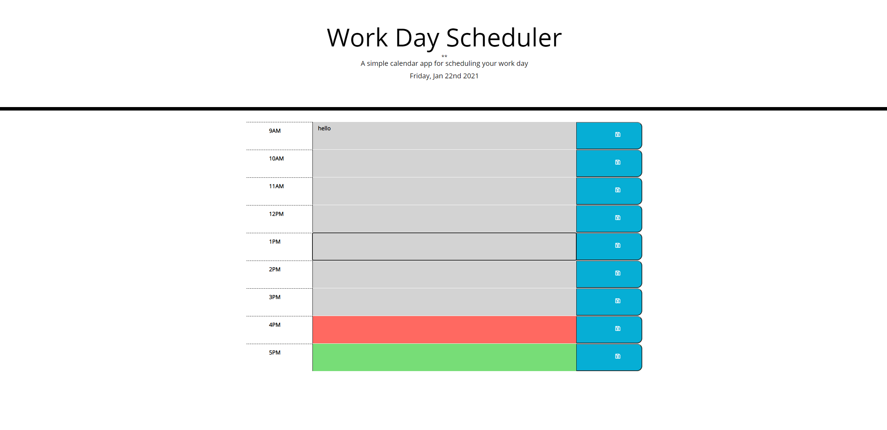

User Story

AS AN employee with a busy schedule
I WANT to add important events to a daily planner
SO THAT I can manage my time effectively

Acceptance Criteria

GIVEN I am using a daily planner to create a schedule
WHEN I open the planner
THEN the current day is displayed at the top of the calendar
WHEN I scroll down
THEN I am presented with time blocks for standard business hours
WHEN I view the time blocks for that day
THEN each time block is color-coded to indicate whether it is in the past, present, or future
WHEN I click into a time block
THEN I can enter an event
WHEN I click the save button for that time block
THEN the text for that event is saved in local storage
WHEN I refresh the page
THEN the saved events persist

ABOUT THE APP

Using JQuerry and Moments.js I was able to write an app that would allow a user to create daily tasks as well as keep up with them in an hourly based manner. They will be able to see how on track they are using the color coded rows of hourly tasks they have set for themselves. I styled the page with a combination of bootstrap and plain CSS as well as using an icon from fontawesome.com

